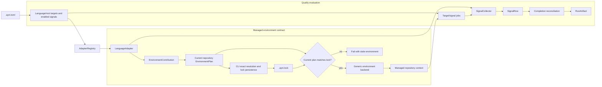
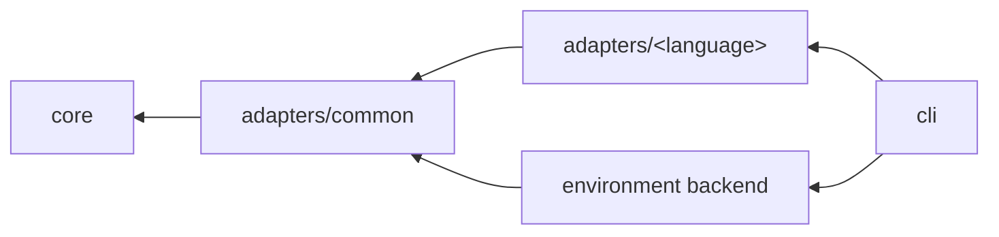
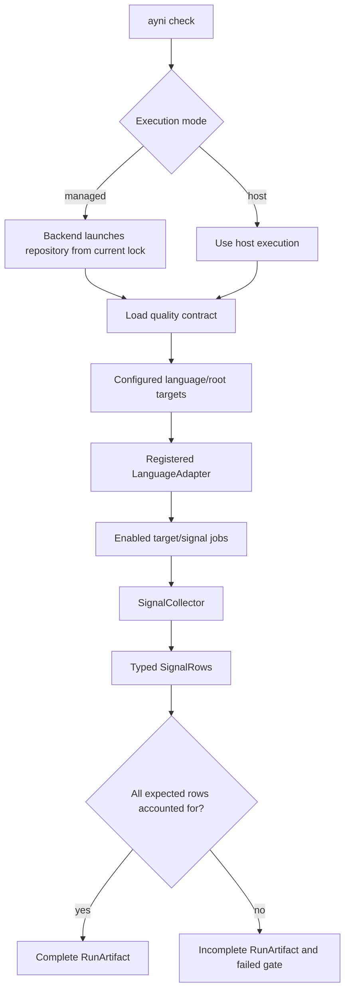

# Contributing Language Adapters

A language adapter translates one ecosystem into Ayni's shared contracts. It
owns language semantics, but it does not own repository orchestration, managed
environment logistics, reporting, or artifact schemas.

This guide explains how adapters make Ayni polyglot, which components belong in
an adapter, and how those components connect to `ayni-core`. For user-facing
runtime behavior, see [Runtime and verification](/product/runtime). For the
managed lifecycle, see [Managed environments](/product/environments).

## How Ayni achieves polyglot evaluation

Ayni does not make the CLI or environment backend understand Cargo, npm, Go
modules, uv, or Gradle. Each adapter translates ecosystem-specific repository
state into the same semantic core types:

- a language and configured root become a `TargetIdentity`;
- runtime, package-manager, tool, and native-lock requirements become an
  `EnvironmentContribution`;
- one quality measurement becomes a `SignalRow`;
- focused-selector support becomes `VerificationSelectorSupport` and a
  `VerificationTarget`; and
- change analysis becomes an `ImpactContribution`.

The CLI can therefore evaluate every configured language with one orchestration
path and reconcile every result with one completion model.



The adapter supplies data and behavior through core interfaces. Environment
planning aggregates its contributions into a current repository plan. Explicit
`env lock` performs exact resolution and persists that plan. Before a managed
quality run, the CLI discovers the current requirements again and compares them
with the lock; a difference fails as stale instead of changing the environment.
The generic backend consumes a current lock and decides how managed execution is
provisioned and launched. Adapter code must not contain backend-specific image,
engine, mount, or cache logic.

## Dependency and ownership boundaries

Keep both dependency paths one-way:



The arrows show the allowed dependency direction, not every direct Cargo edge.
A language adapter depends on `ayni-core` and shared adapter infrastructure; it
does not depend on the CLI or the environment backend.

| Component | Owns |
| --- | --- |
| `ayni-core` | Language-neutral interfaces, target identity, signal rows, environment declarations, impact selections, policy, completion, and artifact contracts. |
| `adapters/common` | Shared path, command, discovery, parsing, failure, and conformance-test infrastructure. |
| `adapters/<language>` | Ecosystem detection, workspace semantics, runner resolution, requirement declarations, dependency-preparation declarations, tool invocation, parsing, and impact mapping. |
| `environment` | Lock reading and validation, image planning and construction, preparation execution, managed runtime construction, and launch. |
| `cli` | Adapter registration, repository-plan aggregation, exact resolution and lock persistence, target scheduling, managed-or-host selection, completeness reconciliation, artifact persistence, and presentation. |

Adding a language can require a deliberate core extension for its `Language`
identity and policy mapping. That does not move ecosystem behavior into core.
Manifest interpretation, package-manager rules, commands, and output parsing
remain in the adapter.

## Repository evaluation flow

For a complete `ayni check`:

1. the managed path rebuilds the current environment plan, validates it against
   the lock, and starts one repository-scoped process with activation data for
   every locked target; the explicit host path skips this launch;
2. the repository process loads `.ayni.toml` and enumerates every configured
   language/root target;
3. the CLI finds the matching `LanguageAdapter` in `AdapterRegistry`;
4. the adapter validates detection and resolves the target's execution context;
5. the CLI schedules every enabled signal for every target;
6. the adapter's collector returns one typed `SignalRow` per scheduled signal;
7. the CLI reconciles expected targets and signals with the rows actually
   produced; and
8. it writes one repository-level `RunArtifact`.



Completion means that every expected target/signal row is accounted for; it
does not mean that the repository passed. A complete artifact may still contain
quality failures. Command failures or missing work produce an execution-
incomplete outcome.

A tool failure should become a failed row when valid typed evidence can still be
produced. An invalid contract is rejected before target planning and may produce
no run artifact. After planning, scheduling or collection failures persist an
incomplete artifact that accounts for missing work. An adapter must never hide a
missing language root or enabled signal.

`ayni verify <signal>` uses the same adapter and collector contracts for a
narrower requested scope. `ayni impact run` asks adapter impact capabilities to
select conservative verification work, but it never replaces the final
repository-complete `ayni check`.

## Components of an adapter

Implement `LanguageAdapter` as the facade that connects the following
components to core.

### Language identity and project discovery

Implement:

- `language()` to return the adapter's core `Language` identity;
- `detect(root)` to report presence, confidence, and a useful reason;
- `discover_roots(repo_root)` or `discover_project_roots(repo_root)` to describe
  analyzable roots and workspace layout;
- `profile()` to declare default source globs; and
- `resolve_execution(repo_root, root)` to resolve the ancestry-aware runner,
  setup root, and execution directory.

Discovery owns ecosystem topology. A leaf package may resolve through a
workspace controller above it, but configured roots and resolved paths must
remain inside the repository.

The current command paths are policy-driven: roots configured in `.ayni.toml`
define the target matrix. Their adapter calls differ:

- full check planning calls `detect` and `resolve_execution`;
- environment planning calls `detect` and `discover_environment`; and
- impact planning calls `analyze_impact`, with detection and execution
  resolution deferred until selected verification work runs.

`discover_roots` and `discover_project_roots` expose adapter-owned project
discovery, but they do not populate the configured target matrix and must not
silently add or remove completion targets.

### Signal catalog

`catalog() -> &[CatalogEntry]` declares every external tool invoked directly by
a collector and maps it to the canonical signals that require it. Built-in
source scans are not catalog tools.

The catalog connects signals to managed requirements: environment discovery
must reuse the catalog's `for_signals` mapping rather than maintain a second
tool list. Catalogs are declarative; they do not probe versions, execute tools,
install dependencies, or mutate the checkout.

### Environment declarations

Managed-environment support is expressed through semantic core capabilities:

| Capability | Adapter responsibility | Returned core data |
| --- | --- | --- |
| `EnvironmentCapability` | Read native project metadata for one target and enabled-signal set. | `EnvironmentContribution` containing a `TargetEnvironment`, warnings, and conflicts. |
| `EnvironmentResolutionCapability` | Interpret ecosystem selectors and return exact target requirements during explicit locking. | Resolved `TargetEnvironment`. |
| `DependencyPreparationCapability` | Describe digest-tracked native inputs, structured commands, generated scaffolds, outputs, and execution variables. | `DependencyPreparationPlan`. |

These capabilities describe **what the language needs**, not **how Ayni builds
or runs an environment**. Adapters do not select an OCI engine, construct
images, manage mounts or caches, or execute preparation plans. The environment
backend consumes the declarations uniformly across all languages.

The capability accessors are optional at the `LanguageAdapter` trait level so
adapter support can be introduced incrementally. A language advertised for
managed execution must provide the applicable discovery, exact-resolution, and
dependency-preparation capabilities. Missing managed support fails explicitly;
it must not trigger an implicit host fallback.

Environment discovery is read-only. Resolution may consult the adapter's
provider mechanism but must not modify repository files. Preparation commands
are structured program/argument data—not shell fragments—and are intended for
an isolated staged workspace. Repositories with unsupported or ambiguous native
metadata must produce explicit conflicts instead of silently falling back to a
different setup.

### Signal collectors

`collector() -> &dyn SignalCollector` provides the adapter's typed collectors.
Normally each collector module owns one canonical `SignalKind` and returns one
`SignalRow` containing:

- the adapter language;
- the requested `Scope`;
- a typed signal result;
- configured budget information;
- deterministic pass/warn/fail calculation; and
- repository-relative offenders.

Adapters translate tool-specific output at this boundary. Do not expose raw
language-specific payloads as top-level artifact fields. Follow the [signal
contract](/product/signals) for all shared types.

Implement `required_host_executables` for every signal that launches a process
in explicit host mode. Return only actual executable entry points: selected
overrides when present, otherwise the adapter-resolved runner, directly launched
analysis tools, and executable subcommands dispatched by a runner. Relative commands are interpreted from the
planned `exec_cwd`. Do not expose package imports, plugins, or provider
coordinates as executables merely because they appear in a catalog; the CLI
must not infer language-specific command behavior.

For coverage, populate `CoverageResult.percent` with the headline 0–100
percentage when available and use `line_percent` and `branch_percent` for
available breakdowns. Evaluate every configured threshold independently.
Configured metrics require finite, parseable evidence; never substitute another
metric or fabricate zero for missing evidence.

A collector may opt into `supports_coverage_backed_test` and
`collect_coverage_backed_test` only when one physical coverage execution can
produce complete native evidence for both canonical signals. Return independent
`test` and `coverage` rows in that order, preserve test counts and failures, and
use the common finish helper so execution failure is projected to both rows.
Missing either evidence type must fail the shared execution closed. Keep this
optimization disabled for custom commands unless policy explicitly attests that
the coverage command runs the complete required suite; a coverage percentage or
zero exit status alone is never test evidence.

### Focused verification and findings

For each signal, implement only the selectors the collector applies faithfully:

- `verification_selector_support(kind)` declares `file`, `package`, and the
  test-only `name` selector;
- `collect_verification(...)` applies the validated requested scope; and
- `verification_target(...)` maps an actionable offender back to exact
  selectors.

`LanguageAdapter::collect_verification` rejects unsupported or conflicting
selectors before a tool starts. `findings_for` validates that offender targets
agree with the declared selector support. Do not advertise a selector merely
because an underlying tool accepts a similarly named flag.

### Impact contribution

`impact_capability()` optionally maps local changes for one configured target to
an `ImpactContribution`. Selected work must use supported verification scopes.
Uncertain ownership must broaden conservatively to every enabled signal at the
configured root; it must never omit work silently.

### Policy and concurrency metadata

Use `policy_effectiveness_facts()` for static adapter facts needed to diagnose a
valid but ineffective policy. It must not inspect the repository or execute a
tool.

Use `max_target_concurrency()` only when ecosystem tooling requires a stricter
per-language cap than the repository's global scheduling policy.

## Module layout

Use this crate structure unless a language-specific need requires a small,
documented variation:

```text
src/
├── lib.rs
├── adapter.rs
├── catalog.rs
├── discovery.rs
├── environment.rs
├── environment_resolution.rs
├── preparation.rs
├── impact.rs
└── collectors/
    ├── mod.rs
    ├── test.rs
    ├── coverage.rs
    ├── size.rs
    ├── complexity.rs
    ├── deps.rs
    └── mutation.rs
```

Keep implementation modules private and re-export only the adapter type and any
explicitly supported catalog API from `lib.rs`. Language-specific helpers such
as `package_manager.rs` or `workspace.rs` are expected when ecosystem semantics
require them.

`adapter.rs` should wire the components into `LanguageAdapter`, not absorb their
implementation. Register the completed adapter in the CLI's `AdapterRegistry`;
do not add language-specific orchestration branches to CLI commands.

## Policy conventions

Read global toggles from `[checks]`, language thresholds from
`[<language>.<signal>]`, optional adapter settings from `[<language>]`, and
optional command overrides from
`[<language>.tooling.test|coverage|mutation]`. Fail with a clear error when a
collector's required threshold is missing.

## Documentation format

The adapter user page must use this ordered H2 outline: Installation; Signal
Coverage; Focused verification; Impact planning; Contract; Configuration
Example. State roots and detection, language-specific package-manager or
build-system resolution, each tool's required/optional ownership, and only
versions enforced or selected by code; write “no version enforced” otherwise.
Map every supported or experimental canonical signal to its real measurement tool, and mark unavailable signals explicitly.

The focused-verification section must include a six-signal matrix for `--file`,
`--package`, and `--name`, explain rejection behavior, and say that
requested-scope evidence is written to `.ayni/verify/last/signals.json` rather
than the repository completion artifact. Document policy fields, command
overrides, and missing-policy behavior with a language-specific TOML example.
Catalog entries identify signal dependencies. Mark mutation tooling optional
when its catalog entry is `opt_in`.

## Prohibited patterns

Do not:

- introduce a signal kind without a core contract change;
- emit free-form untyped top-level payloads;
- parse source directly when an available tool supplies the metric;
- duplicate catalog-to-signal mappings in environment discovery;
- provision tools or execute dependency preparation inside an adapter
  capability;
- add language-specific environment or collection behavior to the CLI;
- couple adapter internals to CLI or environment-backend crates; or
- silently narrow work when environment or impact information is uncertain.

## Validation checklist

Before merging an adapter:

1. Register it in `AdapterRegistry` and verify every configured language/root is
   planned, detected where the command requires detection, and assigned to the
   correct adapter.
2. Catalog selection includes every tool required by enabled signals, and the
   environment contribution reuses those mappings.
3. Environment discovery is deterministic and read-only; exact resolution and
   preparation return valid core data without performing backend logistics.
4. Run shared `adapters/common` conformance checks for environment, dependency
   preparation, and impact capabilities where implemented.
5. Unscoped `ayni check` and its explicit `--host` escape hatch emit typed rows
   for every enabled signal kind; only check writes repository-completion
   evidence.
6. Each supported focused selector is faithfully applied; unsupported selectors
   are rejected before tool invocation.
7. Offender fields, stable IDs, and exact verification commands match the signal
   contract.
8. Paths are repository-relative, portable, and stable.
9. Adapter documentation names the exact tools, version contract, managed
   project requirements, and policy controls.
10. Exercise the adapter with real tool fixtures in local and CI coverage,
    including multi-root/polyglot orchestration, collection, configured
    thresholds, missing or unparseable configured evidence, and supported
    selectors. Do not satisfy the contract only with mocked command output.
11. Run:

    ```sh
    cargo fmt --all -- --check
    cargo clippy --workspace --all-targets --all-features -- -D warnings
    cargo test --workspace --all-features
    cargo check --workspace --all-features
    ```
